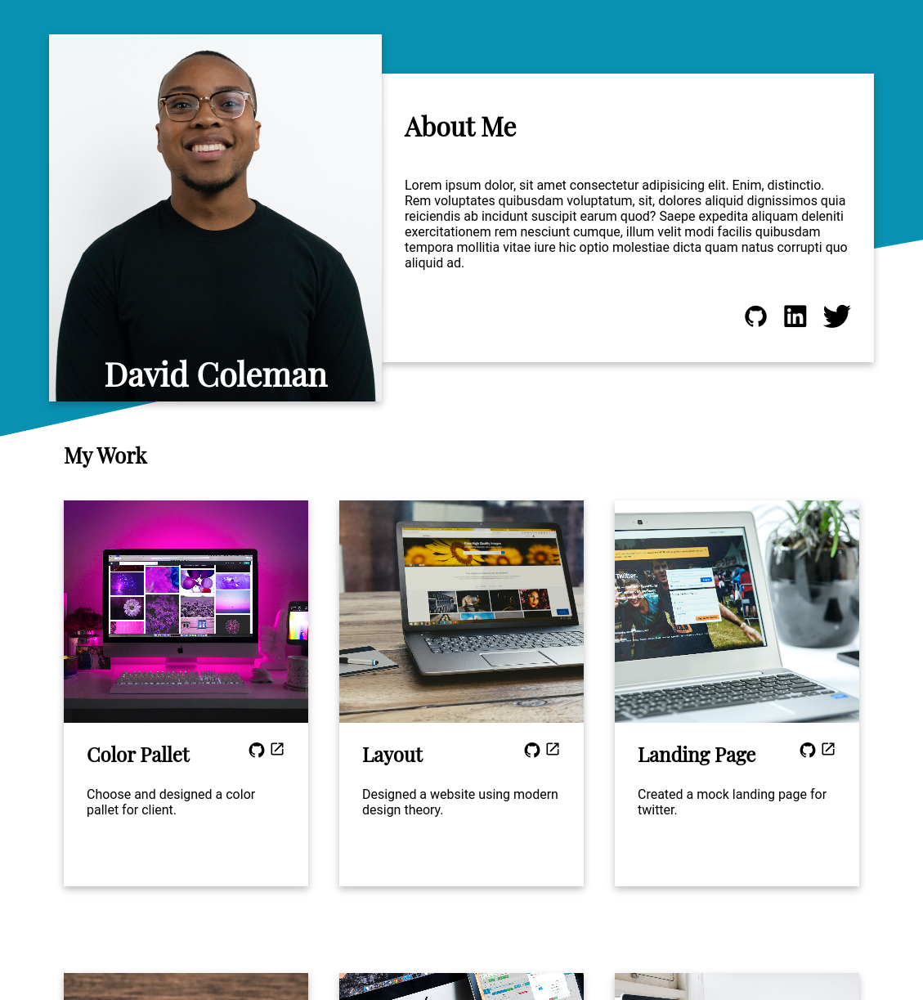

# The Odin Project - Project: Homepage

This is a project assigned by the Odin Project in the Advanced HTML and CSS Course. The objective of the project was to make a responsive web page.

## Table of contents

- [Overview](#overview)
  - [The challenge](#the-challenge)
  - [Screenshot](#screenshot)
  - [Links](#links)
- [My process](#my-process)
  - [Built with](#built-with)
  - [What I learned](#what-i-learned)
  - [Continued development](#continued-development)
  - [Useful resources](#useful-resources)
- [Author](#author)
- [Acknowledgments](#acknowledgments)

## Overview

### The challenge

You are tasked to build a given design brief. We’re providing a full design in 3 different sizes, full desktop, tablet and mobile, and this is the first real project where you should take your time and make sure that it looks acceptable at any screen size.

### Screenshot

### Links

- Solution URL: [GitHub](https://github.com/OnTheHook/web-dev-portfolio)
- Live Site URL: [Live](https://sweet-dieffenbachia-53f773.netlify.app/)

## My process

### Built with

- Semantic HTML5 markup
- CSS custom properties
- Flexbox
- CSS Grid
- Mobile-first workflow
- SASS

### What I learned

I learned how to work with breakpoints and media queries when making responsive websites. I also learned a little about SASS like how to mixins and variables.

### Continued development

I liked using SASS a lot. I want to see if I can incorporate it in future projects. I'm also interested in Tailwind so I may use that instead. Overall, I want to get better at responsive design and also designing websites from scratch.

### Useful resources

- [Figma](https://www.figma.com) - This helped me create custom SVG and work the design files.
- [CSS-Tricks](https://www.example.com) - Helped refresh and reinforce my familiarity with Flexbox and CSS Grid. It was very useful.
- [TheOdinProject](https://www.theodinproject.com) - This project was assigned by The Odin Project. It's a great resource to help you get started on your web development journey.

## Author

- Website - [Lawson Allick](https://onthehook.github.io)

## Acknowledgments

Thank you to the Odin Project for creating a great curriculum. It doesn't hold your hand but it provides you with the structure to make progress in web development.
